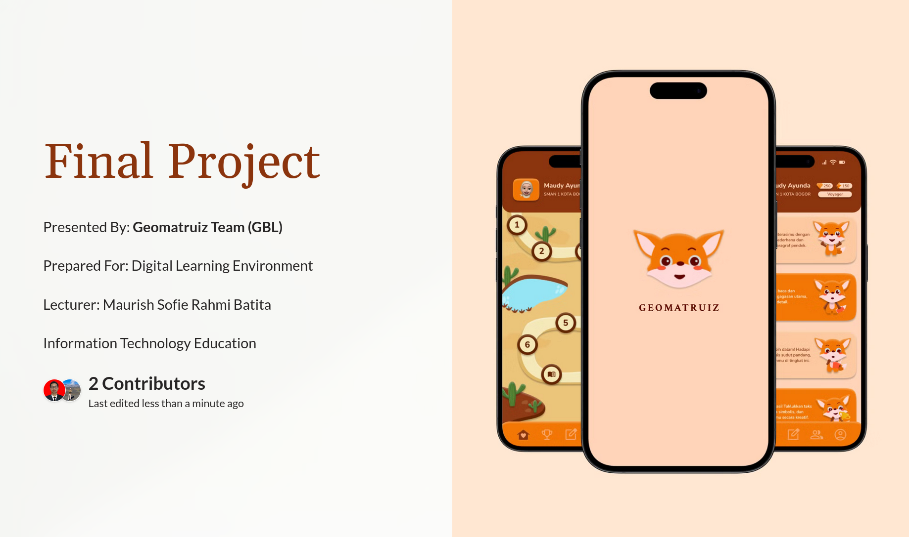

# Geomatruiz

Geomatruiz is a mobile application that helps elementary school students improve their understanding of geometry conectps through gamification learning, personalized learning and quiz based games.

## Problem Identification

Fauzi et al. (2019) found that students experienced difficulties in understanding concepts, principles, and solving verbal problems related to geometry, particularly in calculating the perimeter and area of two-dimensional shapes. This was reflected in the low percentage of student success in answering geometry questions (only 15.3% for perimeter and 3.8% for area of two-dimensional shapes).

## Teams

| Fullname | Role
--- | --
Wilson Hutapea | Project Manager
Devan Ferrel | Developer

## Techstacks
